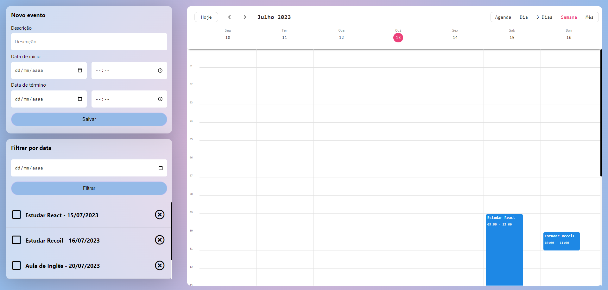

# Event Tracker

O Event Tracker é um MVP de gerenciamento de tarefas.

## 🔨 Funcionalidades do projeto

O Event Tracker é possível fazer inserção, atualização, deleção e filtragem de um evento pela escolha de data e hora.

## ✔️ Técnicas e tecnologias utilizadas

Se liga nessa lista de tudo que foi usado no na aplicação:

- `React`
- `Recoil`
- `Sass`
- `TypeScript`
- `Json-Server`
- `Kalend`
- `Moment`

## 🛠️ Abrir e rodar o projeto

Para abrir e rodar o projeto, execute npm i para instalar as dependências e npm start para inicar o projeto.

Depois, acesse <a href="http://localhost:3000/">http://localhost:3000/</a> no seu navegador.

# Rodar o servidor

Rode o comando na raiz do projeto que simulará uma API Fake.

`npm run server `
